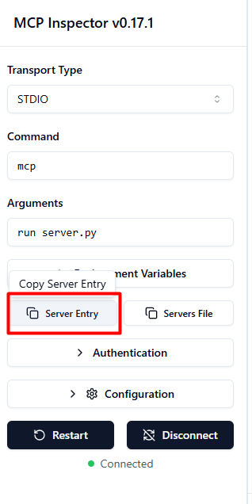
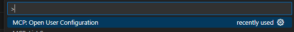
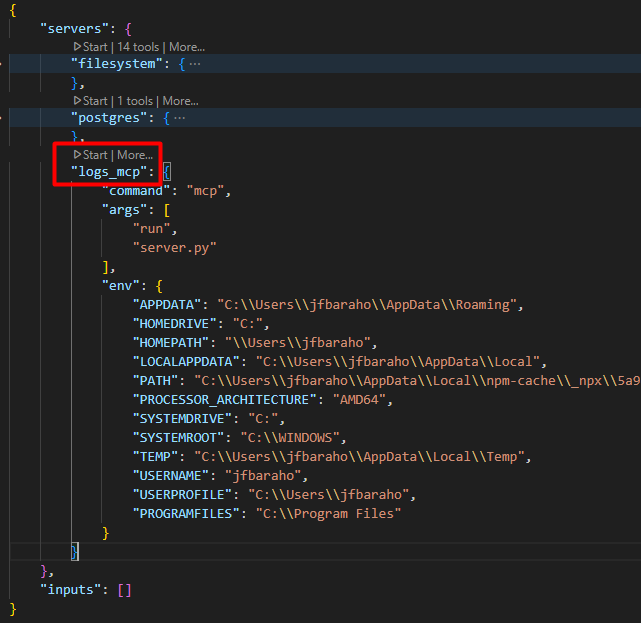
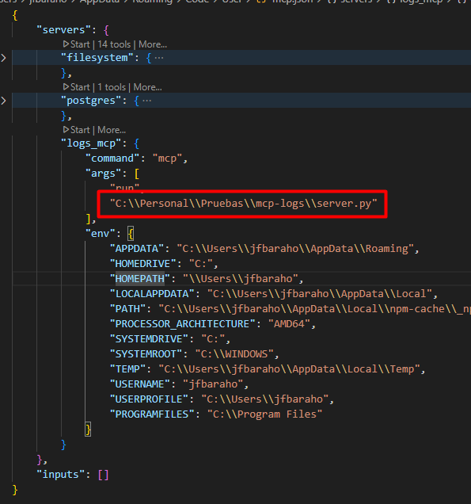
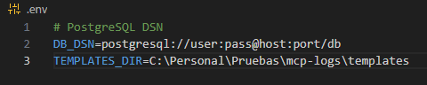
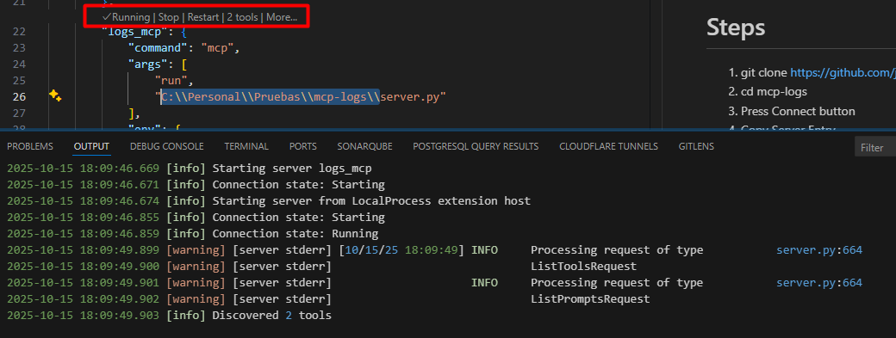
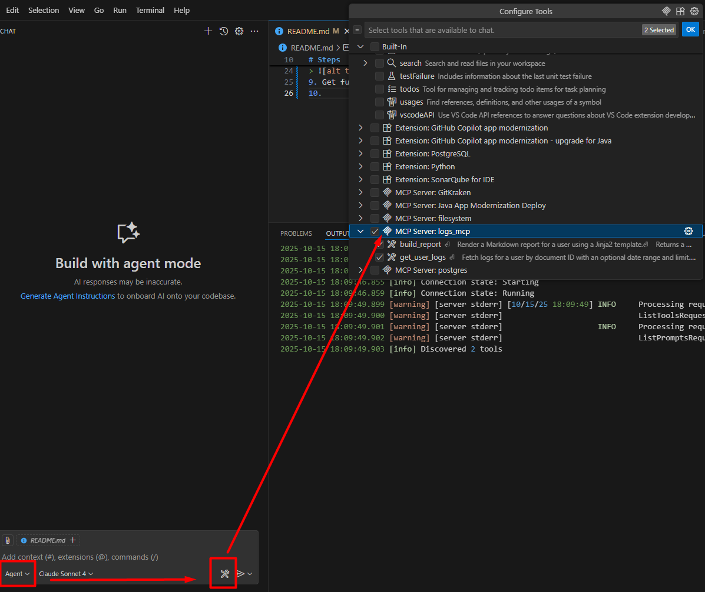

# 📊 MCP Logs

A Model Context Protocol (MCP) server for querying and analyzing user activity logs from a PostgreSQL database.

## ✨ Features

This MCP server provides two main tools:

- **`get_user_logs`** 📋 - Fetch logs for a user by document ID with optional date range filtering and result limiting
- **`build_report`** 📄 - Generate Markdown reports using Jinja2 templates with log summaries and analytics

## 📋 Prerequisites
- npm
- Python >= 3.13
- PostgreSQL database

## 🗄️ Database Setup
1. Run docker compose
2. Load data from db.sql
3. Save credentials for later use

## 🚀 Setup Instructions
1. `git clone https://github.com/jfbarahonag/mcp-logs.git`
2. `cd mcp-logs`
3. Press Connect button
4. Copy Server Entry 
   
   

5. Paste in MCP User Configuration with logs_mcp key
   
   
   

6. Add project's absolute path as prefix to server.py
   
   

7. Create .env file from .env.example, set TEMPLATES_DIR to templates directory and configure the database connection string
   
   

8. Start MCP Server
   
   

9. Ready to use! ✅

10. Select MCP and start chatting 💬
    
    